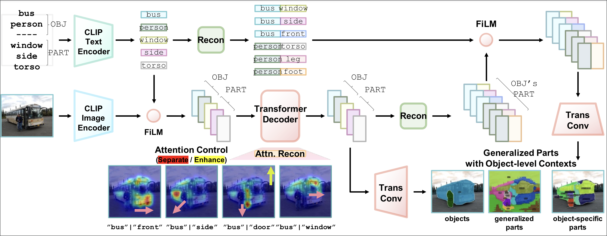

<h2 align="center">
    Understanding Multi-Granularity<br>for Open-Vocabulary Part Segmentation
</h2>
<h5 align="center">
    Anonymous Author(s)<br>
    Affiliation<br>
    Address<br>
    email<br>
  <!-- <a href="https://arxiv.org/pdf/2203.11876.pdf">arXiv</a> |
  <a href="https://www.mmlab-ntu.com/project/ovdetr/index.html">Project Page</a> |
  <a href="https://github.com/yuhangzang/OV-DETR">Code</a> -->
</h5>

---

This is the official implementation of PartCLIPSeg.

<!-- ## Understanding Multi-Granularity for Open-Vocabulary Part Segmentation -->

### PartCLIPSeg

PartCLIPSeg is a framework designed to enhance open-vocabulary part segmentation by integrating generalized parts with object-level contexts and attention controls, improving the model's ability to generalize and segment fine-grained parts accurately.

<div align="center">
    
</div>

### Updates

- TBA

### Installation

<!-- TODO: INSTALL.md -->

```sh
# ------------------
#     Init conda
# ------------------
conda create --name partclipseg python=3.8 -y
conda activate partclipseg
pip install --upgrade pip
conda install cuda=12.4.1 -c nvidia -y
pip install torch==2.2.2 torchvision==0.17.2 --index-url https://download.pytorch.org/whl/cu121
pip install timm==0.9.1
pip install scikit-image==0.21.0
pip install scikit-learn==0.24.2
pip install opencv-python==4.5.5.64
pip install hydra-core==1.3.2
pip install openmim==0.3.6
pip install mmsegmentation==0.29.1
pip install tokenizers==0.11.1
pip install Pillow~=9.5
pip install numpy==1.23.0
pip install einops ftfy regex fire ninja psutil gdown

# --------------------------
#     Install Detectron2
# --------------------------
pip install 'git+https://github.com/facebookresearch/detectron2.git'
python -c "import detectron2; print(detectron2.__version__)"  # 0.6

# --------------------------
#     Install mmcv
# --------------------------
# pip install mmcv-full==1.7.1
# => if an error occurs
pip install mmcv-full==1.7.1 -f https://download.openmmlab.com/mmcv/dist/cu110/torch1.7.0/index.html
python -c "import mmcv; print(mmcv.__version__)"  # 1.7.1
```

### Prepare Datasets

```sh
cd datasets
```

#### PascalPart116
```sh
gdown https://drive.google.com/uc?id=1QF0BglrcC0teKqx15vP8qJNakGgCWaEH # Backup
tar -xzf PascalPart116.tar.gz
find datasets/PascalPart116/images/val/ -name '._*' -delete
find datasets/PascalPart116/ -name '._*' -delete
```

#### ADE20KPart234
```sh
gdown https://drive.google.com/uc?id=1EBVPW_tqzBOQ_DC6yLcouyxR7WrctRKi
tar -xzf ADE20KPart234.tar.gz
```

#### PartImageNet
- Download `LOC_synset_mapping.txt` file from [here](https://www.kaggle.com/c/imagenet-object-localization-challenge/data). Make sure `LOC_synset_mapping.txt` is in the `datasets` folder.
- Download `PartImageNet_Seg` from [PartImageNet](https://github.com/TACJu/PartImageNet) and extract it to the `datasets` folder.


### Preprocess Datasets

- PascalPart116
- ADE20KPart234
- PartImageNet

```sh
# PascalPart116
python baselines/data/datasets/mask_cls_collect.py \
    datasets/PascalPart116/annotations_detectron2_part/val \
    datasets/PascalPart116/annotations_detectron2_part/val_part_label_count.json

python baselines/data/datasets/mask_cls_collect.py \
    datasets/PascalPart116/annotations_detectron2_obj/val \
    datasets/PascalPart116/annotations_detectron2_part/val_obj_label_count.json

# ADE20KPart234
# (no preprocessing required)

# PartImageNet
cd datasets
python partimagenet_preprocess.py --data_dir PartImageNet
# Make sure to have LOC_synset_mapping.txt in the datasets folder mentioned above.
```

### Pre-trained Weights


<table><tbody>
<!-- START TABLE -->
<!-- TABLE HEADER -->
<th valign="bottom">Model</th>
<th valign="bottom">Setting</th>
<th valign="bottom">Dataset</th>
<th valign="bottom">Checkpoint</th>
<!-- TABLE BODY -->
<!-- ROW: per_pixel_baseline_R50_bs16_160k -->
<tr>
    <td align="center">PartCLIPSeg</td>
    <td align="center">zero-shot</td>
    <td align="center">Pascal-Part-116</td>
    <!-- <td align="center"><a href="https://drive.google.com/file/d/1Qf9oLofq8ENBzDaSznP7EBODKkE_Ph2A/view?usp=drive_link">model</a>&nbsp;</td> -->
    <td align="center"><a href="https://drive.google.com/file/d/1ytZpfutk__67GLwB-4jMClehJlnAzYFS/view?usp=share_link">model</a>&nbsp;</td>
</tr>
<tr>
    <td align="center">PartCLIPSeg</td>
    <td align="center">zero-shot</td>
    <td align="center">ADE20K-Part-234</td>
    <!-- <td align="center"><a href="https://drive.google.com/file/d/1XqgHI4CRcfLIz2j8_ZbIvoF_GFjMqCqn/view?usp=drive_link">model</a>&nbsp;</td> -->
    <td align="center"><a href="https://drive.google.com/file/d/10UTxrlamYq2rq3Uuv1GdOxpLy8f-QXoz/view?usp=share_link">model</a>&nbsp;</td>
</tr>

</tbody></table>

<!-- # CLIPSeg + Zero-shot (clipseg_ft_VA_L_F_voc.pth (810M))
gdown https://drive.google.com/uc?id=1WkCu3-KA2Oho5xzBXDR_HUmBvvKKYSQM -->

```sh
mkdir weights && cd weights

# Pascal-Part-116
# PartCLIPSeg + Zero-shot (partclipseg_voc_oracle.pth (829M))
gdown https://drive.google.com/uc?id=1ytZpfutk__67GLwB-4jMClehJlnAzYFS

# ADE20K-Part-234
# PartCLIPSeg + Zero-shot (partclipseg_voc_oracle.pth (829M))
gdown https://drive.google.com/uc?id=10UTxrlamYq2rq3Uuv1GdOxpLy8f-QXoz

```

### Usage (Run)

##### Zero-Shot Prediction

```sh
# -------------
#     Train
# -------------
python train_net.py \
    --num-gpus 8 \
    --config-file configs/zero_shot/partclipseg_voc_oracle.yaml

# -----------------
#     Inference
# -----------------
python train_net.py \
    --num-gpus 8 \
    --config-file configs/zero_shot/partclipseg_voc_oracle.yaml \
    --eval-only MODEL.WEIGHTS ./weights/partclipseg_voc_oracle.pth
```

### Project Structure

##### Important Files

```sh
configs/zero_shot/partclipseg_voc_oracle.yaml
configs/zero_shot/partclipseg_voc_pred_all.yaml
baselines/partclipseg.py
baselines/evaluation/partclipseg_evaluation.py
baselines/data/dataset_mappers/object_part_mapper.py
baselines/data/datasets/register_pascal_part_116.py
transformers/models/partclipseg/processing_partclipseg.py
transformers/models/partclipseg/modeling_partclipseg.py
```


```markdown
[PROJECT_ROOT]
├── datasets/
│   ├── PascalPart116/
│   │   ├── images
│   │   ├── annotations_detectron2_obj
│   │   └── annotations_detectron2_part
│   ├── ADE20KPart234/
│   └── PartImageNet/
├── weights/
│   ├── clip_weights/
│   ├── partclipseg_voc_oracle.pth
│   └── partclipseg_ade_oracle.pth
├── configs/
│   ├── zero_shot
│   │   ├── partclipseg_voc_oracle.yaml
│   │   ├── partclipseg_voc_pred_all.yaml
│   │   ├── partclipseg_ade_oracle.yaml
│   │   ├── partclipseg_ade_pred_all.yaml
│   │   └── ...
│   └── cross_dataset
├── baselines/
│   ├── evaluation/
│   │   └── partclipseg_evaluation.py
│   ├── data/
│   │   ├── dataset_mappers/
│   │   │   └── object_part_mapper.py
│   │   └── datasets/
│   │       └── register_pascal_part_116.py
│   ├── utils/
│   ├── third_party/
│   ├── partclipseg.py
│   └── config.py
├── transformers/
│   ├── utils/
│   ├── models/
│   │   └── partclipseg/
│   │       ├── processing_partclipseg.py
│   │       └── modeling_partclipseg.py
│   └── trainer.py
├── README.md
└── train_net.py
```


### Acknowledgement

We would like to express our gratitude to the open-source projects and their contributors, including [OV-PARTS](https://github.com/OpenRobotLab/OV_PARTS), [CLIPSeg](https://github.com/timojl/clipseg), [Mask2Former](https://github.com/facebookresearch/Mask2Former), [CLIP](https://github.com/openai/CLIP), and [OV-DETR](https://github.com/yuhangzang/OV-DETR).

<!-- [ViT](https://github.com/google-research/vision_transformer)
[Swin](https://github.com/microsoft/Swin-Transformer) -->

### Issues

##### `torch.nn.parallel.DistributedDataParallel`

```
# vim ~/miniconda3/envs/partclipseg/lib/python3.8/site-packages/detectron2/engine/defaults.py
# Line 74
(AS IS) `ddp = DistributedDataParallel(model, **kwargs)`
(TOBE) `ddp = DistributedDataParallel(model, **kwargs, find_unused_parameters=True)`
```

> RuntimeError: Expected to have finished reduction in the prior iteration before starting a new one. This error indicates that your module has parameters that were not used in producing loss. You can enable unused parameter detection by passing the keyword argument `find_unused_parameters=True` to `torch.nn.parallel.DistributedDataParallel`, and by making sure all `forward` function outputs participate in calculating loss.
